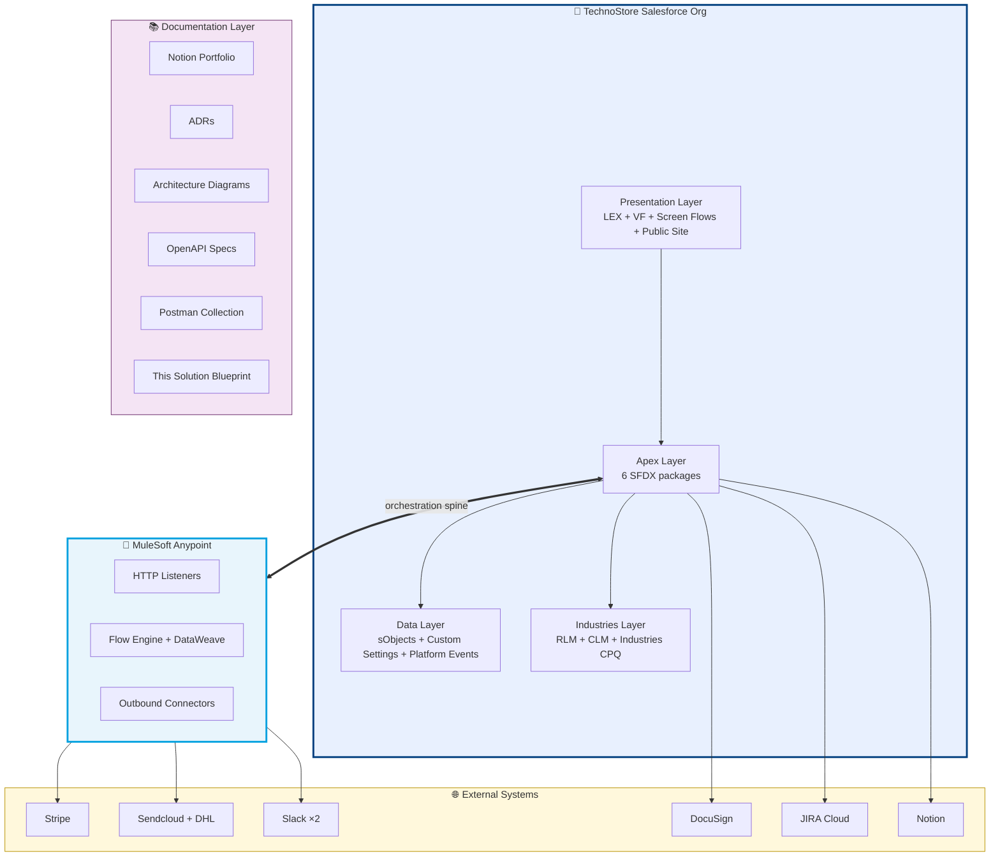

# TechnoStore — Solution Blueprint

> **Single-document architecture summary in [arc42](https://docs.arc42.org) format.**
> Synthesizes the full architectural picture into one architect-readable document. For deep-dive on any topic, the relevant section links to the corresponding ADR, architecture diagram, OpenAPI spec, or Notion portfolio entry.

| Metadata | Value |
|----------|-------|
| Project | TechnoStore — Salesforce Revenue Cloud Demo (DACH Market) |
| Document version | 1.0 |
| Document date | 2026-05-11 |
| Status | Active |
| Author | Mustafa Aksu |
| Template | [arc42](https://docs.arc42.org) v8.2 (Karlsruhe community standard) |
| License | MIT (see [LICENSE](../LICENSE)) |

## Table of Contents

1. [Introduction and Goals](#1-introduction-and-goals)
2. [Architecture Constraints](#2-architecture-constraints)
3. [System Scope and Context](#3-system-scope-and-context)
4. [Solution Strategy](#4-solution-strategy)
5. [Building Block View](#5-building-block-view)
6. [Runtime View](#6-runtime-view)
7. [Deployment View](#7-deployment-view)
8. [Cross-cutting Concepts](#8-cross-cutting-concepts)
9. [Architecture Decisions](#9-architecture-decisions)
10. [Quality Requirements](#10-quality-requirements)
11. [Risks and Technical Debt](#11-risks-and-technical-debt)
12. [Glossary](#12-glossary)

---

## 1. Introduction and Goals

### 1.1 Requirements overview

TechnoStore GmbH (fictional) is a **B2B supplier of workstations, peripherals, cables, and software licenses to DACH-market enterprise IT buyers**. The system supports the full **Quote-to-Cash (Q2C) lifecycle** for sales representatives in Germany, Austria, and Switzerland, integrating with seven external systems to handle payment processing, parcel logistics, e-signature, team notifications, ticket tracking, and portfolio documentation.

The reference implementation is a Salesforce portfolio project targeting **DACH-market enterprise B2B Revenue Cloud + integration architecture roles** (T-Systems, Deutsche Bank IT, Allianz Technology, Mercedes-Benz.io, BMW Group IT, Capgemini, Accenture). The system models — and is intended to demonstrate — production-grade architectural patterns for the same skill mix those job specs ask for.

### 1.2 Quality goals

In priority order:

| # | Quality goal | Concrete scenario |
|---|--------------|-------------------|
| 1 | **Integration reliability** | All seven external systems converge on a single Order activation within 6 seconds, with HMAC-verified webhooks and idempotent retry handling |
| 2 | **DACH market fit** | 4 demo accounts (Hamburg / München / Frankfurt / Köln), 19% German VAT visible at Quote stage, Sendcloud + DHL parcel routing, branded PDFs in B2B sender style |
| 3 | **Architectural defensibility** | Every significant decision documented as an ADR with explicit alternatives considered; engineers can explain *why* each choice was made |
| 4 | **Maintainability** | 6-package SFDX layout, Kevin O'Hara TriggerHandler, Selector pattern, Mule-vs-Apex decision matrix — all reduce cognitive load for new contributors |
| 5 | **Recruiter scannability** | README, ADRs, Mermaid diagrams, OpenAPI specs, Postman collection, Notion portfolio — each artifact answers a specific reviewer question in under 60 seconds |

### 1.3 Stakeholders

| Role | Expectation |
|------|-------------|
| Sales Rep (DACH) | Quote a customer in <5 minutes including bundle configuration + VAT calculation; trust that Order activation triggers all downstream systems reliably |
| Warehouse User | Receive Slack notification when stock check is needed; approve via dedicated VF page (separation of duties from sales) |
| Manager / Legal | Approve Contract via screen flow; trust that DocuSign envelope routing + signing workflow is reliable |
| B2B Customer | Receive branded INVOICE + RECEIPT emails; pay on Stripe-hosted page; sign DocuSign envelope from email link |
| DACH Recruiter | Open GitHub repo + Notion portfolio + demo recording; understand candidate's level in 12 minutes |
| Solution Architect (interview panel) | Drill into specific decisions via ADR + diagrams + OpenAPI; assess whether candidate can justify trade-offs |

---

## 2. Architecture Constraints

### 2.1 Technical constraints

| Constraint | Source | Impact |
|------------|--------|--------|
| **Salesforce Developer Edition limits** | Free tier | 5 MB data + 20 MB file storage; 100 Apex callouts per execution; 5000 daily emails; storage management required (see ADR roadmap + Notion entry 42) |
| **Apex API version 66.0** | `sfdx-project.json` | All Apex compiles against API 66; deprecated API features must not be used |
| **Industries CPQ + RLM + CLM features** | Required for demo | Scratch org definition (`config/project-scratch-def.json`) opts into these features; without them deploy fails |
| **Notion API 2-level nesting per request** | Vendor API limit | 3-level nested toggles require 6 API calls per portfolio entry (see ADR-010) |
| **Stripe API form-encoded payload** | Vendor design | Outbound payload must be `application/x-www-form-urlencoded` not JSON (DataWeave transform documented in Notion entry 30) |
| **Sendcloud v3 deprecation of v2 for new accounts** | Vendor change in early 2026 | New accounts must use v3 `/orders` bare-array schema (see Notion entry 33) |
| **MuleSoft Anypoint Studio 7.16 + CloudHub 1.0** | ADR-006 decision | Code Builder + CloudHub 2.0 failed; demo runs on the proven legacy runtime |

### 2.2 Organizational constraints

| Constraint | Source | Impact |
|------------|--------|--------|
| **MIT licensing** | Portfolio openness | All custom code MIT-licensed; third-party code (Kevin O'Hara TriggerHandler) preserves its own MIT license |
| **DACH market localization expectations** | Job market targeting | German addresses, German VAT (19%), DACH-popular tools (Sendcloud, DATEV planned), German B2B email sender style (Org-Wide Address per ADR-007) |
| **Solo engineer** | Portfolio is one-person project | Decisions live in ADRs + memory files rather than in inter-team meeting notes; future maintainability matters even though there's no current team |

### 2.3 Convention constraints

| Constraint | Documented in |
|------------|---------------|
| **Six-package SFDX layout for separation of concerns** | ADR-004 + CONTRIBUTING.md |
| **Kevin O'Hara TriggerHandler framework** for all triggers | ADR-005 + CONTRIBUTING.md |
| **Mule vs Apex decision matrix** applied to every new integration | ADR-001 + CONTRIBUTING.md |
| **ApexDoc headers** on every public class + method | CONTRIBUTING.md |
| **Selector pattern (FFLib-style)** for all SOQL | CONTRIBUTING.md |
| **Credentials in Protected Hierarchy Custom Settings** populated by gitignored setup scripts | CONTRIBUTING.md + multiple ADRs |
| **`.gitattributes` LF line endings** for all metadata + Apex + YAML | committed `.gitattributes` |

---

## 3. System Scope and Context

### 3.1 Business context

TechnoStore sits at the center of a B2B sales process involving five stakeholder roles and seven external systems. The full landscape is documented in [`docs/architecture/01-context.md`](architecture/01-context.md) as a Mermaid C4 Context diagram. Summary:

```
                     5 Actors                        7 External Systems
                     ────────                        ──────────────────
              Sales Rep                              Stripe (payments)
              B2B Customer                           Sendcloud + DHL (logistics)
              Warehouse User    ──>  TechnoStore <── Slack #payments-team
              Finance Team           Salesforce      Slack #warehouse
              Manager / Legal        Revenue Cloud   DocuSign (e-signature)
                                                     Atlassian JIRA (tickets)
                                                     Notion (portfolio docs)
                                                     MuleSoft (orchestration spine)
```

The four DACH demo accounts segment the market by employee count + industry:

| Account | City | Employees | Industry | Visible workstation tiers |
|---------|------|-----------|----------|---------------------------|
| Hamburg DataWorks | Hamburg | 200 | Technology | Entry + Standard + Pro + Mission-Critical |
| München Industrial GmbH | Munich | 350 | Manufacturing | Entry + Standard + Pro |
| Frankfurt FinTech Hub AG | Frankfurt | 1200 | Financial Services | Entry + Standard + Pro + Mission-Critical |
| Köln Retail Cloud SE | Cologne | 50 | Retail | Entry only |

Product Qualification (RLM) drives Browse Catalog filtering based on `Account.NumberOfEmployees`.

### 3.2 Technical context

External system communication channels — what protocol, what direction, what authentication. For full schemas, see [`openapi/`](../openapi/).

| External system | Direction | Protocol | Authentication | TechnoStore-side handler |
|-----------------|-----------|----------|----------------|---------------------------|
| Stripe (Payment) | Outbound | HTTP POST form-encoded | Basic Auth (secret key as username) | MuleSoft `stripe-create-paymentintent.xml` |
| Stripe (Webhook) | Inbound | HTTP POST JSON | HMAC-SHA256 + 5-min timestamp freshness | MuleSoft `stripe-webhook-receive.xml` |
| Sendcloud v3 | Outbound | HTTP POST JSON (bare-array) | Basic Auth (public + secret keys) | MuleSoft `sendcloud-create-order-v3.xml` |
| DHL (via Sendcloud) | Outbound (transitive) | HTTP (Sendcloud manages) | Sendcloud-managed | (no direct integration) |
| Slack #payments-team | Outbound | HTTP POST JSON Block Kit | Webhook URL = credential | MuleSoft `slack-payments-notify.xml` |
| Slack #warehouse | Outbound | HTTP POST JSON Block Kit | Webhook URL = credential | MuleSoft `slack-warehouse-notify.xml` |
| DocuSign (Send) | Outbound | HTTP POST JSON | OAuth via Named Credential | Apex `DocuSignSendForSignatureService` |
| DocuSign (Connect) | Inbound | HTTP POST JSON | Payload-shape validation + envelope-id idempotency (HMAC planned — see SECURITY.md) | Apex `DocuSignConnectWebhook` (SF Site) |
| JIRA Cloud | Outbound | HTTP POST/PUT JSON | Basic Auth (email + API token) | Apex `JiraTicketService`, `JiraSprintService` |
| Notion | Outbound | HTTP POST/PATCH JSON | Bearer token | Apex `NotionPublishService` |

---

## 4. Solution Strategy

### 4.1 Technology decisions (summary)

The full set of architectural decisions lives in [`docs/adr/`](adr/). At the strategic level, four foundational choices shape the rest:

1. **Salesforce Industries CPQ + RLM + CLM as the central platform.** Standard sObjects (Account / Opportunity / Quote / Order / Contract / Asset) carry the Q2C lifecycle. RLM Product Qualification filters Browse Catalog by Account context. CLM lifecycle is replaced with custom screen flows (the native buttons are broken — see ADR-005 + Notion entry 22).
2. **MuleSoft Anypoint Studio + CloudHub 1.0 as the integration orchestration layer**, used selectively per the Mule-vs-Apex decision matrix in ADR-001. Mule handles fan-out + webhooks + complex DataWeave transforms; Apex handles single-system + trigger-fired + record-bound callouts.
3. **Six-package SFDX layout** (ADR-004) enforces separation of concerns at the deploy-target level. `force-app/` for metadata + sObjects, `force-app-controllers/` for UI + REST, `force-app-services/` for external API callouts, `force-app-handlers/` for TriggerHandler + Platform Event subscribers, `force-app-actions/` for `@InvocableMethod` Flow actions, `force-app-tests/` for test classes.
4. **Kevin O'Hara TriggerHandler framework** (ADR-005) is the non-negotiable trigger standard. All Apex triggers are 3-line files delegating to handler classes that extend the MIT-licensed vendored framework. Free recursion guard + bypass API + max-loop protection.

### 4.2 Decomposition strategy

The system decomposes into seven major building blocks (detailed in Section 5):

- **Presentation Layer** (Lightning Experience + Visualforce + Screen Flows + Public Site)
- **Apex Layer** (5 subpackages — Controllers, Services, Handlers, Actions, Tests)
- **Data Layer** (standard sObjects + custom fields + Custom Settings + Custom Metadata + Platform Events)
- **Industries Layer** (RLM + CLM + Industries CPQ — Pricing Procedure, Product Qualification, Contract Lifecycle)
- **MuleSoft Layer** (HTTP listeners + Flow engine + DataWeave + connectors, deployed to CloudHub 1.0)
- **External System Adapters** (per-integration code in `force-app-services/` or `mulesoft/` flows)
- **Documentation Layer** (Notion portfolio + ADRs + Mermaid diagrams + OpenAPI + Postman + this Blueprint)

### 4.3 Strategy for achieving quality goals

| Quality goal (Section 1.2) | Strategy |
|----------------------------|----------|
| Integration reliability | Mule-vs-Apex matrix per integration; HMAC verification at all webhook receivers; idempotency guards (Order.Status filter, Platform Event subscriber idempotency); Scatter-Gather parallel fan-out for max-of-durations not sum |
| DACH market fit | 4 DACH demo accounts; 19% VAT formula fields on Quote (commercetax adapter preserved for Invoice — see ADR-009); Sendcloud + DHL routing; Org-Wide Email Address for B2B deliverability (ADR-007); branded PDFs via Flying Saucer VF (ADR-008) |
| Architectural defensibility | 10 ADRs with explicit alternatives considered (Michael Nygard format); `memory/` directory with 28 entries; Notion portfolio 50 STAR entries; cross-references between artifacts |
| Maintainability | Six-package SFDX layout; Kevin O'Hara TriggerHandler; Selector pattern; Mule-vs-Apex decision matrix in CONTRIBUTING.md; ApexDoc on every public method |
| Recruiter scannability | README "at-a-glance" hub linking to all artifacts; tables-not-prose where possible; consistent visual conventions (orange/blue brand palette, Mermaid diagram color coding per external service brand) |

---

## 5. Building Block View

### 5.1 Whitebox overall system

The system breaks into the seven major building blocks introduced in Section 4.2. Detailed Mermaid Container diagram (C4 Level 2) is in [`docs/architecture/02-container.md`](architecture/02-container.md). High-level summary:



### 5.2 Apex Layer (5 subpackages)

The Apex code is split across five SFDX package directories per ADR-004:

| Package | Responsibility | Example classes |
|---------|---------------|------------------|
| `force-app-controllers/` | VF controllers + `@RestResource` REST endpoints; own request/response cycle | `ContractPdfController`, `InvoicePdfController`, `WarehouseInventoryApprovalController`, `RevenuePulseController` |
| `force-app-services/` | External API callout services; own outbound HTTP | `DocuSignSendForSignatureService`, `JiraTicketService`, `JiraSprintService`, `NotionPublishService`, `AttachAndEmailInvoicePreview`, `EmailWithBrandedPdf`, `TechnoStoreTaxEngineAdapter`, `AttributePricingHandler` |
| `force-app-handlers/` | TriggerHandler base + per-sObject handlers + Platform Event subscribers; own `Trigger.*` context | `TriggerHandler`, `OrderItemTriggerHandler`, `QuoteLineItemTriggerHandler`, `DocuSignConnectWebhook` (REST), `DocuSignStatusUpdateTriggerHandler` (PE subscriber), `InventoryStatusUpdateTriggerHandler` |
| `force-app-actions/` | `@InvocableMethod` Flow actions; expose FlowAction surface | `BundleDecompositionAction`, `GetRevenueSummaryAction`, `InventoryApprovalDecisionService`, `SendPaymentRemindersAction` |
| `force-app-tests/` | All test classes; separate package enables CI test-only deploys | `*Test.cls` companions to every production class |

Cross-package call direction rules:

- Controllers → Services or Actions (downward only)
- Handlers → Services (downward only)
- Services → Selectors (own data access, never inverse)
- Selectors → SOQL (terminal layer)
- Tests → any production package

### 5.3 MuleSoft Layer

`mulesoft/` directory contains an Anypoint Studio 7.16 project deployed to CloudHub 1.0. Six core flows:

| Flow | Type | Purpose |
|------|------|---------|
| `stripe-create-paymentintent.xml` | Outbound | SF Order → Stripe PaymentIntent + hosted URL return |
| `stripe-webhook-receive.xml` | Inbound | Stripe Connect → HMAC verify → Scatter-Gather (SF + Slack + email) |
| `sendcloud-create-order-v3.xml` | Outbound | SF Order → Sendcloud v3 bare-array with dynamic customer info |
| `slack-payments-notify.xml` | Outbound branch | Stripe webhook → #payments-team Block Kit |
| `slack-warehouse-notify.xml` | Outbound subscriber | SF Platform Event → #warehouse Block Kit + VF deep link |
| `post-payment-fulfillment-router.xml` | Routing | Mule Choice on `Order.Product_Type__c` (Physical / Digital / Mixed) |

OpenAPI specification: [`openapi/technostore-mule.yaml`](../openapi/technostore-mule.yaml).

### 5.4 Documentation Layer

Six documentation artifacts that mutually cross-reference:

| Artifact | Location | Audience |
|----------|----------|----------|
| README.md | repo root | First-impression scan (30 seconds) |
| 50-entry Notion portfolio | external Notion page | Interview prep (STAR format, long-form) |
| 10 ADRs | `docs/adr/` | Architecture review (Michael Nygard format) |
| 5 Mermaid architecture diagrams | `docs/architecture/` | Visual scan (C4 Context + Container + Sequence + Data Model + CI/CD) |
| OpenAPI specs + Postman collection | `openapi/` + `postman/` | API contract review + runnable tests |
| This Solution Blueprint | `docs/SOLUTION_BLUEPRINT.md` | Single-document architect briefing (arc42) |

---

## 6. Runtime View

### 6.1 Quote-to-Cash end-to-end sequence

Full sequence diagram in [`docs/architecture/03-sequence-q2c.md`](architecture/03-sequence-q2c.md). Summary of the 11-stage flow:

| Stage | Trigger | Actions | Latency |
|-------|---------|---------|---------|
| 1 | Sales rep opens Browse Catalog | Product Qualification filters tiers by Account.NumberOfEmployees | <1 sec |
| 2 | Selects Workstation Pro + Configure | AttributePricingHandler `@future` fires; UnitPrice += €200 | 2-5 sec |
| 3 | Saves Quote | Tax formula fields compute 19% VAT instantly | <1 sec |
| 4 | Converts to Order, clicks Activate | Order.Status: Draft → Activated | <1 sec |
| 5 | **OrderTriggerHandler.afterUpdate() fan-out** | 4 parallel actions: JIRA + Slack #warehouse PE + DocuSign + Stripe + INVOICE email | 2-6 sec |
| 6 | Customer receives INVOICE email, clicks Pay Now | Stripe-hosted page; customer enters card | 30-90 sec (customer time) |
| 7 | Stripe Connect webhook fires | Mule HMAC verify + Scatter-Gather: SF Order.Status=Paid + Slack #payments-team + RECEIPT email | 2-5 sec |
| 8 | Mule Choice router branches on Product_Type__c | Physical: Sendcloud v3 + DHL pickup + shipping email; Digital: license + welcome email | 3-10 sec |
| 9 | Warehouse user opens Slack notification, marks stock | Custom VF page → Order.Inventory_Status__c updated with audit fields | <2 sec |
| 10 | Customer signs DocuSign envelope | DocuSign Connect → SF Site Guest User → Platform Event → trigger subscriber updates Contract.Status=Signed | 30-60 sec |
| 11 | Sales rep clicks Activate Contract custom screen flow | Autolaunched subflow invokes `createOrUpdateAssetFromOrder` → Asset created on Account | <5 sec |

**Total Q2C lifecycle elapsed time** (excluding customer wait): ~60 seconds across 11 stages and 7 external systems.

### 6.2 Critical runtime patterns

Three runtime patterns deserve specific attention because they're reused across multiple integrations:

1. **HMAC-verified inbound webhook** (Stripe, DocuSign Connect) — verify signature header against stored secret + timestamp freshness window before any side effect. See ADR-003 for the Salesforce Site + Guest User + Platform Event indirection variant.
2. **Scatter-Gather parallel fan-out** (Mule, post-Stripe-webhook) — N independent downstream calls fire in parallel; total elapsed = max(branch durations), not sum.
3. **`@future` async trigger callout** (JIRA from Order activation, AttributePricingHandler from QLI save) — async execution off the trigger context; isolates governor pressure + enables retry via Async Apex Errors.

---

## 7. Deployment View

Full CI/CD diagram in [`docs/architecture/05-cicd.md`](architecture/05-cicd.md). Summary:

### 7.1 Deployment targets

| Target | Purpose | Source |
|--------|---------|--------|
| **Salesforce Developer Edition org** | Demo + development | `force-app/` + 4 sibling packages deployed via `sf project deploy start` |
| **Salesforce Scratch Org** (CI) | Automated test runs | GitHub Actions scratch-org-tests job |
| **Salesforce Sandbox** | Pre-production validation | `sf project deploy validate` |
| **Salesforce Production** (future) | Live deployment | `sf project deploy quick` from validate Job ID |
| **MuleSoft CloudHub 1.0** | Mule runtime | Anypoint Runtime Manager deploy from Anypoint Studio |
| **MuleSoft Local Standalone** (dev) | Local testing | Mule Standalone 4.4.x via Anypoint Studio Run Configuration |
| **DocuSign Sandbox** (`demo.docusign.net`) | E-signature dev/test | Manual envelope template config |
| **Stripe Test mode** (`sk_test_*`) | Payment dev/test | Stripe Dashboard test toggle |
| **Notion Workspace** (Mustafa Aksu's) | Portfolio | Notion Internal Integration token |

### 7.2 CI/CD pipeline

GitHub Actions workflow (`.github/workflows/ci.yml`) runs on every push and PR to `main`:

- **lint job** (always runs) — PMD 7.7.0 static analysis against all 5 Apex package directories using `pmd-ruleset.xml`. No secrets required.
- **preflight job** — checks for `SFDX_AUTH_URL` repo secret; outputs `can-deploy=true/false`.
- **scratch-org-tests job** (conditional on `can-deploy=true`) — authorizes DevHub via `SFDX_AUTH_URL`, creates scratch org with Industries CPQ + RLM + CLM features, deploys all 5 packages, assigns permission set, runs all Apex tests with coverage, deletes scratch org via `if: always()` cleanup.

MuleSoft deployments are out-of-band — not part of this Salesforce CI/CD flow (manual Anypoint Runtime Manager deploys; planned future Mule CI/CD pipeline as a roadmap item).

---

## 8. Cross-cutting Concepts

### 8.1 Security

**Authentication patterns:**

- **OAuth (Named Credential)** — DocuSign outbound. Token refresh handled by Named Credential.
- **OAuth Username-Password Flow (External Client App per ADR-001)** — MuleSoft → Salesforce. PKCE explicitly OFF because Mule HTTP Connector does not support PKCE.
- **HTTP Basic Auth (Custom Setting credentials)** — JIRA Cloud (email + API token), Stripe (secret key as username), Sendcloud (public + secret keys).
- **Bearer Token (Custom Setting credentials)** — Notion (Internal Integration token).
- **Webhook URL = credential** — Slack incoming webhooks (channel-scoped URL is the auth).
- **Inbound webhook authentication (see SECURITY.md for full model):**
  - **MuleSoft layer (Stripe Connect)** — HMAC-SHA256 signature verification with 5-min timestamp freshness (DataWeave `Crypto::HMACBinary`).
  - **Apex Site webhooks (WhatsApp, JIRA, SAP, DocuSign Connect, Inventory callback)** — plaintext shared-secret equality check (`X-*-Secret` header or `?secret=` fallback) + external-id idempotency via `WebhookEventLogger`. Cryptographic HMAC hardening for Apex webhooks is on the roadmap (tracked issue TS-SEC-002).

**FLS + Sharing:**

- Selector classes use `WITH USER_MODE` SOQL for FLS enforcement
- Service classes are `with sharing` by default; documented exceptions noted in class headers
- Public Site Guest User profile **does not have FLS** on `Contract.Status` / `Order.Status` standard fields; the Platform Event indirection (ADR-003) handles this

**Secrets storage:**

- Protected Hierarchy Custom Settings for runtime-needed credentials (Notion, JIRA, DocuSign)
- `mule-app.properties` for Mule-side credentials (Stripe, Sendcloud, Slack)
- All credentials gitignored via patterns in `.gitignore`
- Setup scripts that populate credentials are themselves gitignored (`scripts/setup_jira_config.apex`, `scripts/setup_notion_config.apex`)

### 8.2 Error handling

**Trigger context (Apex):**

- `try/catch` at the handler method boundary — log via `System.debug` + create `Integration_Log__c` record (future enhancement) + do NOT block the parent DML
- Recursion protection via Kevin O'Hara `TriggerHandler.maxLoopCount=3`
- Bypass mechanism `TriggerHandler.bypass(handlerName)` for data migration

**External API callouts (Apex):**

- HTTP timeout: 60 seconds via `req.setTimeout(60000)`
- Status code check: 2xx success, otherwise throw custom `<Service>Exception`
- Non-2xx responses log full response body via `System.debug` for forensic analysis

**Webhook receivers:**

- HMAC verification failure → return 400 (external system will retry)
- Timestamp older than 5 minutes (Stripe) → return 400 (replay protection)
- Internal exception → return 500 (external system will retry; bug in our code, observable via Apex logs)
- Idempotent processing: query for existing terminal state, skip if already applied

**MuleSoft flows:**

- Try-Catch scope around each flow with logging
- Dead Letter Queue for failed outbound calls (future enhancement)
- Retry policy with exponential backoff for transient external failures
- HTTP timeout configured per HTTP Request configuration

### 8.3 Logging

- Apex `System.debug` at info level for normal operation
- Apex `System.debug(LoggingLevel.ERROR, ...)` for caught exceptions
- Mule `<logger>` element at INFO level for flow lifecycle events
- Anypoint Monitoring (CloudHub 1.0 built-in) for Mule-side request volume + latency + error rate
- Salesforce Debug Logs filtered by user + class for targeted debugging

Future enhancement: `Integration_Log__c` custom sObject capturing every external API call with request/response payloads + timing + correlation ID (sub-row of Order). Currently planned, not implemented.

### 8.4 Naming conventions

- **Apex classes**: PascalCase (`NotionPublishService`, not `Notion_Publish_Service`)
- **Apex methods**: camelCase (`publishEnterprise`, not `publish_enterprise`)
- **Custom fields**: `Snake_Case_With_Suffix__c` (`Jira_Ticket__c`, `DocuSign_Envelope_Id__c`)
- **Custom Settings**: `<System>_Config__c` (`Notion_Config__c`, `Jira_Config__c`)
- **Platform Events**: `<DomainEvent>__e` (`DocuSign_Signed__e`, `Inventory_Check_Requested__e`)
- **Custom Metadata Types**: `Techno_<Concept>__mdt` (`Techno_Attribute_Price_Rule__mdt`)
- **Permission Sets**: `<Capability>_Access` (`Notion_Publisher_Access`)
- **Mule flows**: `<system>-<verb>-<noun>.xml` (`stripe-create-paymentintent.xml`, `sendcloud-create-order-v3.xml`)
- **ADR files**: `ADR-NNN-<kebab-case-title>.md`
- **Memory files**: `<topic_in_snake_case>.md`

### 8.5 Documentation conventions

- ApexDoc headers on every public class with `@description`, `@group`, `@author`, `@date`
- ApexDoc on every public method with `@description`, `@param`, `@return`
- Architecture diagrams in Mermaid (GitHub-native rendering), saved as `.md` files in `docs/architecture/`
- ADRs in Michael Nygard format with `Alternatives Considered` extension
- README badges for status indicators (API version, integrations count, Notion portfolio scale, etc.)

### 8.6 Internationalization (DACH-specific)

- Demo accounts use real DACH addresses (Reeperbahn 142 Hamburg, Marienplatz 8 München, etc.)
- VAT defaults to 19% (Germany); multi-country lookup planned for AT 20% + CH 7.7%
- Currency defaults to EUR; multi-currency enablement is a future scratch-org definition flag
- Email content currently English; German + French translation is a future localization work item

---

## 9. Architecture Decisions

Ten Architecture Decision Records in [`docs/adr/`](adr/) capture the significant decisions. Index:

| ADR | Decision | Status |
|-----|----------|--------|
| [001](adr/ADR-001-mule-vs-apex-decision-matrix.md) | Mule vs Apex per integration use case | Accepted |
| [002](adr/ADR-002-custom-metadata-over-attribute-based-adjustment.md) | Custom Metadata Type over native AttributeBasedAdjustment | Accepted (workaround) |
| [003](adr/ADR-003-site-guest-user-platform-event-indirection.md) | Salesforce Site + Guest User + Platform Event indirection for inbound webhooks | Accepted |
| [004](adr/ADR-004-six-package-sfdx-layout.md) | Six-package SFDX layout for separation of concerns | Accepted |
| [005](adr/ADR-005-kevin-ohara-trigger-handler-adoption.md) | Kevin O'Hara TriggerHandler framework adoption | Accepted |
| [006](adr/ADR-006-anypoint-studio-over-code-builder.md) | MuleSoft Anypoint Studio over Code Builder | Accepted (revisit Q4 2026) |
| [007](adr/ADR-007-org-wide-email-address.md) | Org-Wide Email Address for DACH B2B deliverability | Accepted |
| [008](adr/ADR-008-flying-saucer-vf-pdf.md) | Flying Saucer VF over LWC for branded PDFs | Accepted |
| [009](adr/ADR-009-quote-tax-formula-invoice-tax-adapter.md) | Quote tax via formula fields, Invoice tax via commercetax adapter | Accepted |
| [010](adr/ADR-010-notion-api-multi-call-orchestration.md) | Notion API multi-call orchestration for 3-level nested toggles | Accepted |

For ADR conventions + template + lifecycle, see [`docs/adr/README.md`](adr/README.md).

---

## 10. Quality Requirements

### 10.1 Quality tree

Following the ISO 25010 / arc42 quality tree pattern:

```
TechnoStore Quality
│
├── Reliability (priority 1)
│   ├── Integration retry idempotency
│   ├── HMAC verification on all webhooks
│   └── Order activation fan-out within 6 seconds
│
├── Usability (priority 2)
│   ├── Quote-to-Cash demo runs in 12 minutes
│   ├── Sales rep finds Configure UI within 30 seconds of opening Quote
│   └── Recruiter understands the system from README in 5 minutes
│
├── Maintainability (priority 3)
│   ├── New integration follows Mule-vs-Apex matrix (ADR-001)
│   ├── New Apex class placed in correct SFDX package (ADR-004)
│   └── New decision documented as ADR within 1 week
│
├── Performance (priority 4)
│   ├── Order activation fan-out total elapsed <= 6 sec
│   ├── Notion portfolio publish 50 entries <= 25 minutes
│   └── Stripe webhook → SF update <= 5 sec
│
└── Security (priority 5)
    ├── No credentials committed to git
    ├── HMAC verification on all inbound webhooks
    └── Apex with sharing on all DML/SOQL classes
```

### 10.2 Quality scenarios

| Scenario | Stimulus | Response | Measure |
|----------|----------|----------|---------|
| **Q-1: Order activation fan-out** | Sales rep clicks Activate on Order | JIRA + Slack + DocuSign + Stripe + Email all fire | All 5 complete within 6 seconds end-to-end |
| **Q-2: Stripe webhook idempotency** | Stripe re-delivers payment_intent.succeeded event 3 times in 30 seconds | SF Order.Status flips to Paid once; no duplicate Slack messages; no duplicate RECEIPT emails | Database state identical regardless of delivery count |
| **Q-3: Configurator latency** | Sales rep selects 32GB RAM on Workstation Pro | UnitPrice updates from €1,499 to €1,699 | Visible within 5 seconds (async @future settling) |
| **Q-4: Browse Catalog filtering** | Sales rep switches account context from Hamburg (200 emp) to Köln (50 emp) | Visible workstation tiers change from 4 to 1 | Visible within 30 seconds (Salesforce caching) |
| **Q-5: New engineer onboarding** | New engineer clones repo, reads README + ADRs | Understands the seven-system integration architecture | Can answer "why is Stripe on Mule but JIRA on Apex" within 15 minutes |
| **Q-6: Production credential leak** | Engineer accidentally `git add scripts/setup_notion_config.apex` | `.gitignore` prevents commit | Pre-commit hook (Husky) catches the staging attempt |

---

## 11. Risks and Technical Debt

### 11.1 Known risks

| Risk | Likelihood | Impact | Mitigation |
|------|------------|--------|------------|
| **Dev Edition storage limit (5 MB data)** | Medium (current at 67% post-cleanup) | High (blocks deploys) | Storage audit scripts (`scripts/storage_audit.apex`); future migration to higher-tier org for production |
| **Salesforce CLM native button bugs** | High (occurred multiple times in this project) | Medium (already worked around) | Custom screen flow replacements per ADR-005 + Notion entries 22-24; native buttons removed from layout |
| **MuleSoft Code Builder + CloudHub 2.0 instability** | Medium (currently re-evaluating Q4 2026) | Low (Anypoint Studio + CloudHub 1.0 working alternative) | Decision documented in ADR-006; revisit criteria specified |
| **External API breaking changes** (Sendcloud v2 deprecation pattern) | Medium (precedent set) | High (integration breaks until migrated) | Notion portfolio entry 33 documents Sendcloud v2→v3 migration recipe; pattern reusable for future API deprecations |
| **DocuSign Connect webhook delivery delays** | Low (DocuSign SLA) | Medium (Contract status lag) | Idempotent processing tolerates eventual delivery; demo narrative accounts for 30-60 sec webhook delivery time |
| **Notion API rate limit (3 RPS average)** | Low (portfolio publish is one-time batch) | Low (slows publish, doesn't fail) | Batch scripts run sequentially with implicit pacing |
| **GitHub Actions scratch org dependency on SFDX_AUTH_URL secret** | Medium (one-time setup) | Low (lint job runs unconditionally, scratch-org job gracefully skips) | Preflight job documents requirement; CONTRIBUTING.md has setup steps |

### 11.2 Technical debt

| Debt | Source | Cost to repay | Priority |
|------|--------|---------------|----------|
| **Native AttributeBasedAdjustment bypass** (Custom Metadata Type workaround) | ADR-002 | 2-4 hours migration when SF fixes Builder UI bug | Low (workaround is production-ready) |
| **No `Integration_Log__c` sObject yet** | Logging convention deferred | 4-8 hours to design + implement + retrofit existing services | Medium (improves debuggability significantly) |
| **PMD warm-up mode** (`\|\| true` on lint failures) | CI ramp-up | 1-2 hours to clean codebase against ruleset + remove `\|\| true` | Low |
| **Manual MuleSoft deploys** (no CI for Mule) | Out-of-scope for current phase | 1-2 days to wire Anypoint deploy step into GitHub Actions | Medium |
| **Single-country VAT (DE 19% hardcoded)** | ADR-009 | 4-6 hours to migrate to Tax_Rate__mdt lookup | Medium (blocks AT/CH market) |
| **No `force-app-tests/` independent CI deploy yet** | Six-package layout includes it but unused | 2-4 hours to wire test-only deploy in workflow | Low |
| **Demo placeholder domain (`technostore.example`)** | Documentation phase | Register real `technostore.de` + DNS + SPF + DKIM + DMARC: 1 day + ongoing renewal | Medium (production-readiness blocker) |
| **Demo recording not on YouTube unlisted** | Documentation phase | 30 minutes upload + README link update | Low |
| **No `force-app-tests/` test coverage measurement in CI** | Setup phase | 2-3 hours to add coverage threshold gate | Medium |

### 11.3 Future roadmap (ranked by DACH-recruiter impact)

**Tier 1 — DACH-specific killer features:**

- **SAP S/4HANA integration** (sprint 68 TS-2 through TS-9, 17 SP) — SAP API Hub + OData + IDoc + bidirectional BusinessPartner / Sales Order replication
- **GDPR / DSGVO compliance workflow** — Right-to-be-Forgotten custom Apex + DSAR VF page + consent management + audit log
- **Multi-country VAT localization** — Tax_Rate__mdt + IBAN + BIC + Steuernummer

**Tier 2 — Modern tech signal:**

- **Claude / GenAI integration** — `ClaudeAIService.cls` Apex callout to Anthropic API for sentiment analysis + RAG + sales copilot
- **Custom LWC multi-tab bundle configurator** — Dell-style multi-classification configurator (replaces native single-classification limit)
- **Salesforce Experience Cloud customer portal** — self-service Order history + tracking + contract viewing

**Tier 3 — Enterprise maturity:**

- DATEV integration (DACH accounting CSV export)
- Klarna / Sofort payment (DACH-popular Stripe alternative)
- CRM Analytics dashboards (Q2C velocity, forecasting per DACH country)

---

## 12. Glossary

| Term | Definition |
|------|------------|
| **ADR** | Architecture Decision Record — immutable Michael Nygard-format markdown document capturing a single architectural decision with context, decision, consequences, and alternatives considered |
| **AGG** | Allgemeines Gleichbehandlungsgesetz — German General Equal Treatment Act; relevant to hiring fairness in DACH market context |
| **arc42** | Software architecture documentation template originating in the Karlsruhe (German) community; this document follows its 12-section structure |
| **Apex** | Salesforce's proprietary server-side language; this project uses API version 66.0 |
| **AttributeBasedAdjustment** | Industries CPQ standard sObject for bundle attribute-driven price adjustments; broken in our org, replaced via ADR-002 |
| **Browse Catalog** | Industries CPQ customer-facing storefront UI for product browsing |
| **CLM** | Contract Lifecycle Management — Salesforce add-on for contract authoring, approval, signing, and asset creation |
| **CloudHub 1.0 / 2.0** | MuleSoft's managed runtime targets; this project uses CloudHub 1.0 per ADR-006 |
| **CMT** | Custom Metadata Type — Salesforce metadata-as-data primitive, deployable via SFDX |
| **commercetax** | Salesforce Apex namespace for tax engine adapters |
| **CPQ** | Configure / Price / Quote — Salesforce module for bundle products + pricing |
| **DACH** | Germany (D) + Austria (A) + Switzerland (CH); the project's target market |
| **DataWeave** | MuleSoft's transformation language (DSL); used for JSON / form-encoded / XML transforms |
| **DSGVO** | Datenschutz-Grundverordnung — German abbreviation for GDPR |
| **External Client App** | Salesforce's modern replacement for Connected App; required for new OAuth integrations |
| **FFLib** | "FinancialForce.com Library" — an open-source Apex enterprise patterns framework; this project adopts the Selector pattern from it but not the full framework |
| **FLS** | Field-Level Security — Salesforce per-field read/edit permission |
| **Flying Saucer** | The PDF rendering library used by Visualforce `renderAs="PDF"`; documented in ADR-008 |
| **HMAC** | Hash-based Message Authentication Code; used for webhook signature verification |
| **Industries CPQ** | Salesforce Industries vertical's CPQ implementation (distinct from Salesforce CPQ aka Steelbrick) |
| **LWC** | Lightning Web Components — Salesforce's modern UI framework |
| **Mermaid** | Markdown-based diagram syntax that GitHub renders natively; used for all 5 architecture diagrams |
| **Named Credential** | Salesforce primitive for storing external API credentials + auth flow; used for DocuSign |
| **Notion** | The documentation platform hosting the 50-entry STAR portfolio; also documented via ADR-010 |
| **Org-Wide Email Address** | Salesforce primitive for a shared sender email identity; documented in ADR-007 |
| **PaymentIntent** | Stripe's payment authorization primitive; created server-side + completed on Stripe-hosted payment page |
| **PE / Platform Event** | Salesforce's event-bus primitive; this project uses them for inbound webhook indirection (ADR-003) and Mule → SF fan-out |
| **PMD** | Programming Mistake Detector — static analysis tool for Apex (and other languages); configured in `pmd-ruleset.xml` |
| **Postman** | API client tool; the collection at `postman/TechnoStore.postman_collection.json` covers all 7 integrations |
| **Probezeit** | German probationary period (typically 6 months) at the start of employment |
| **Q2C** | Quote-to-Cash — the end-to-end revenue lifecycle from Quote through Order to Asset |
| **RLM** | Revenue Lifecycle Management — Salesforce's umbrella term for Industries CPQ + Industries Pricing + Order Management |
| **SAP S/4HANA** | SAP's flagship ERP; DACH market standard; integration is a future roadmap item |
| **Scatter-Gather** | MuleSoft parallel-fan-out scope; total elapsed = max(branch durations) |
| **Sendcloud** | DACH-popular parcel logistics service; v2 deprecated for new accounts, project uses v3 (Notion entry 33) |
| **SFDX** | Salesforce DX — Salesforce's modern developer tooling + source-driven development model |
| **sObject** | Salesforce's term for any database table-like entity (Account, Contract, custom objects, etc.) |
| **STAR** | Situation / Task / Action / Result — narrative framework used for the 50-entry Notion portfolio |
| **Tarif** | Collective labor agreement in DACH; sets salary bands at most large employers |
| **TriggerHandler** | Kevin O'Hara's open-source Apex trigger framework (MIT licensed); vendored per ADR-005 |
| **VF** | Visualforce — Salesforce's legacy UI framework; still used for `renderAs="PDF"` per ADR-008 |
| **WITH USER_MODE** | Modern Apex SOQL clause that enforces FLS automatically (replaces manual `Schema.sObjectType.X.isAccessible()` checks) |

---

## Document maintenance

This Blueprint is a **living document** revised on major architectural changes. Update history is tracked via `git log -- docs/SOLUTION_BLUEPRINT.md`.

When the system architecture changes significantly (new integration added, decision superseded, layer restructured), update this Blueprint in the same commit as the ADR documenting the change. Cross-references should remain valid — broken links across `docs/adr/`, `docs/architecture/`, `openapi/`, `postman/` indicate stale documentation.

For the deeper context behind any decision summarized here, the path is always: this Blueprint → [ADRs](adr/) → [Notion portfolio](https://www.notion.so/) (50 STAR entries) → memory files (gitignored, used in AI-assisted development sessions).

---

*End of Solution Blueprint. Last revised 2026-05-11.*
