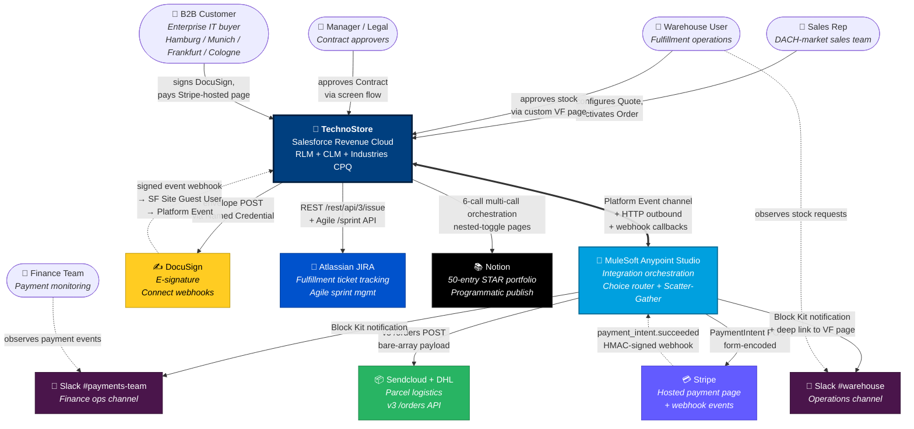

# 01 — System Context Diagram (C4 Level 1)

## Purpose

Shows TechnoStore's place in the wider world: **who interacts with the system** and **what external systems it integrates with**. This is the highest-level architectural view — no internal Salesforce details, just the boundaries.

Useful for: onboarding stakeholders in 60 seconds, framing recruiter conversations, scoping new integration discussions.

## Diagram

## Reading the diagram

- **Solid arrows** (→) are synchronous outbound calls initiated by the actor or system on the left
- **Dashed arrows** (-.->) are asynchronous webhooks or event subscriptions initiated by the system on the right
- **Bold bidirectional** (⇔) marks the orchestration spine where Salesforce and MuleSoft cooperate as peers
- **Color coding** matches each external service's brand palette so the visual is instantly recognizable

## Key architectural observations

1. **TechnoStore Salesforce sits at the center** — every actor's interaction either reads from it (Sales Rep view) or writes to it via custom flow (Warehouse approval, Manager approval).
2. **MuleSoft is the orchestration spine for multi-system fan-out** — not a router for all integrations. Single-system Apex callouts (DocuSign, JIRA, Notion) bypass Mule per the Mule-vs-Apex decision matrix (see `entry 46` in the Notion portfolio).
3. **Webhook receivers (Stripe → Mule, DocuSign → SF Site) use HMAC signature verification** to prevent spoofing — non-negotiable for payment-affecting events.
4. **The Customer never directly touches Salesforce** — they interact with Stripe-hosted payment page + DocuSign signing UI + branded email PDFs. Salesforce sits behind the integration layer.

## Drill-down

For the next level of detail (what's *inside* TechnoStore Salesforce + what's inside MuleSoft), see [02 — Container Diagram](02-container.md).
