# 02 — Container Diagram (C4 Level 2)

## Purpose

One level deeper than the Context diagram (01). Shows the **major technical containers** inside TechnoStore Salesforce and MuleSoft Anypoint Studio, plus the protocols/channels each container uses to talk to its peers.

Useful for: explaining the deployable units of the system, scoping CI/CD pipelines, onboarding new engineers to the codebase.

## Diagram

```mermaid
graph TB
    %% ============ External Actors ============
    SalesRep(["👤 Sales Rep / Warehouse / Manager"])
    Customer(["👤 B2B Customer"])

    %% ============ Salesforce Org boundary ============
    subgraph SF["🏢 TechnoStore Salesforce Org (Industries CPQ + RLM + CLM)"]
        direction TB

        subgraph UI["🖥️ Presentation Layer"]
            LEX["Lightning Experience<br/><i>Sales App + Browse Catalog</i>"]
            VFPages["Visualforce Pages<br/><i>Invoice PDF (orange)<br/>Receipt PDF (green)<br/>Contract PDF<br/>Warehouse Approval</i>"]
            ScreenFlows["Screen Flows<br/><i>CLM Submit / Sign /<br/>Approve / Activate</i>"]
            Site["Public Salesforce Site<br/><i>/docusign_webhook<br/>Guest User profile</i>"]
        end

        subgraph Apex["⚙️ Apex Layer (5 SFDX Packages)"]
            Controllers["force-app-controllers/<br/><i>VF + @RestResource</i>"]
            Services["force-app-services/<br/><i>External API callouts<br/>(DocuSign, JIRA, Notion,<br/>Stripe-bound logic)</i>"]
            Handlers["force-app-handlers/<br/><i>TriggerHandler base<br/>+ per-sObject + PE subscribers</i>"]
            Actions["force-app-actions/<br/><i>@InvocableMethod for Flow</i>"]
            Tests["force-app-tests/"]
        end

        subgraph Data["💾 Data Layer"]
            StdObjects["Standard sObjects<br/><i>Account / Opportunity /<br/>Quote / Order / Contract / Asset</i>"]
            CustomFields["Custom Fields<br/><i>Tax formulas, Configured_*<br/>Stripe / DocuSign / JIRA IDs</i>"]
            CustomSettings["Custom Settings<br/><i>Notion_Config__c<br/>Jira_Config__c<br/>DocuSign_Config__c</i>"]
            CMT["Custom Metadata<br/><i>Techno_Attribute_Price_Rule__mdt</i>"]
            PE["Platform Events<br/><i>Inventory_Check_Requested__e<br/>DocuSign_Signed__e</i>"]
        end

        subgraph Industries["🏭 Industries CPQ + RLM + CLM"]
            RLM["Product Qualification<br/>+ Pricing Procedure<br/>+ Bundle Configurator"]
            CLM["Contract Lifecycle<br/>+ Document Template<br/>+ Approval Process"]
        end
    end

    %% ============ MuleSoft Anypoint boundary ============
    subgraph Mule["🔌 MuleSoft Anypoint Studio Project"]
        direction TB

        subgraph MuleListeners["HTTP Listeners (inbound)"]
            StripeWH["/stripe/webhook<br/><i>HMAC-SHA256 verify<br/>+ 5-min timestamp freshness</i>"]
            SFListener["/order/fulfill<br/><i>SF Connector poll<br/>+ Platform Event subscriber</i>"]
        end

        subgraph MuleFlows["Flow Engine"]
            Choice["Choice Router<br/><i>Physical / Digital / Mixed</i>"]
            Scatter["Scatter-Gather<br/><i>Parallel fan-out</i>"]
            DataWeave["DataWeave Transforms<br/><i>form-encoded → JSON<br/>SF Order → Sendcloud v3<br/>SF Order → Slack Block Kit</i>"]
        end

        subgraph MuleConnectors["Outbound Connectors"]
            SFConnector["Salesforce Connector<br/><i>OAuth username-password<br/>External Client App</i>"]
            HTTPOut["HTTP Outbound<br/><i>Stripe + Sendcloud + Slack</i>"]
        end
    end

    %% ============ External Systems ============
    Stripe["💳 Stripe<br/>api.stripe.com/v1/*"]
    Sendcloud["📦 Sendcloud<br/>panel.sendcloud.sc/api/v3"]
    SlackHooks["💬 Slack Incoming Webhooks<br/>hooks.slack.com/services/*"]
    DocuSign["✍️ DocuSign<br/>account.docusign.com/restapi/v2.1"]
    JIRA["🎫 JIRA Cloud<br/>*.atlassian.net/rest/api/3"]
    Notion["📚 Notion<br/>api.notion.com/v1"]

    %% ============ User flows ============
    SalesRep -->|"HTTPS browser"| LEX
    SalesRep -.->|"Slack notifications"| SlackHooks
    Customer -->|"HTTPS browser"| Stripe
    Customer -->|"DocuSign email link"| DocuSign

    %% ============ Salesforce internal wiring ============
    LEX --> Apex
    LEX --> Industries
    VFPages --> Controllers
    ScreenFlows --> Actions
    Site --> Controllers
    Apex --> Data
    Handlers --> PE
    Services --> CustomSettings
    Industries --> CustomFields
    Industries --> CMT

    %% ============ Salesforce <-> Mule ============
    Apex -->|"HTTP outbound<br/>(Stripe PaymentIntent)"| SFListener
    PE -->|"streaming channel<br/>/event/Inventory_Check_Requested"| SFListener
    Mule -->|"SF Connector OAuth<br/>upsert Order / Contract"| SFConnector
    SFConnector --> Data

    %% ============ Salesforce -> External direct (Apex) ============
    Services -->|"Named Credential<br/>callout:DocuSign_API"| DocuSign
    Services -->|"Custom Setting auth<br/>REST /rest/api/3/issue"| JIRA
    Services -->|"Bearer token<br/>POST /v1/pages"| Notion

    %% ============ Inbound webhooks ============
    Stripe -.->|"signed events"| StripeWH
    DocuSign -.->|"Connect webhook<br/>HMAC X-DocuSign-Signature-1"| Site
    Site -->|"Guest User publishes"| PE
    PE -->|"trigger subscriber<br/>system context"| Handlers

    %% ============ Mule -> External ============
    Choice --> Scatter
    StripeWH --> Scatter
    Scatter --> HTTPOut
    DataWeave --> HTTPOut
    HTTPOut -->|"form-encoded body"| Stripe
    HTTPOut -->|"bare-array JSON"| Sendcloud
    HTTPOut -->|"Block Kit JSON"| SlackHooks

    %% ============ Styling ============
    style SF fill:#E8F0FE,stroke:#003F7F,stroke-width:3px
    style Mule fill:#E8F5FC,stroke:#00A0DF,stroke-width:3px
    style UI fill:#F4E4F4,stroke:#6C2D6C
    style Apex fill:#FFEBE0,stroke:#FF6B00
    style Data fill:#E8FFE8,stroke:#1D7E45
    style Industries fill:#FFF8DC,stroke:#B89200
    style MuleListeners fill:#D6F5FF,stroke:#0080B8
    style MuleFlows fill:#D6F5FF,stroke:#0080B8
    style MuleConnectors fill:#D6F5FF,stroke:#0080B8
    style Stripe fill:#635BFF,stroke:#4A3FCF,color:#fff
    style Sendcloud fill:#28B463,stroke:#1D7E45,color:#fff
    style DocuSign fill:#FFCC22,stroke:#B89200,color:#000
    style SlackHooks fill:#4A154B,stroke:#2D0C2E,color:#fff
    style JIRA fill:#0052CC,stroke:#003A91,color:#fff
    style Notion fill:#000,stroke:#333,color:#fff
```

## Container ownership map

| Container | Technology | Deploy target | Source location |
|-----------|------------|---------------|-----------------|
| Lightning Experience UI | LWC / Aura / Lightning App Builder | Salesforce org | `force-app/main/default/applications/` + `pages/` |
| Visualforce Pages | Apex VF + Flying Saucer | Salesforce org | `force-app/main/default/pages/` |
| Screen Flows | Flow Builder | Salesforce org | `force-app/main/default/flows/` |
| Public Site | Salesforce Sites + Guest User | Salesforce org | `force-app/main/default/sites/` |
| Apex Controllers | Apex `@RestResource` + VF controllers | Salesforce org | `force-app-controllers/` |
| Apex Services | Apex callout services | Salesforce org | `force-app-services/` |
| Apex Handlers | TriggerHandler + Platform Event subscribers | Salesforce org | `force-app-handlers/` |
| Apex Actions | `@InvocableMethod` classes | Salesforce org | `force-app-actions/` |
| MuleSoft Flows | DataWeave + HTTP listeners + outbound | CloudHub 1.0 | `mulesoft/src/main/mule/flows/` |
| Salesforce Connector | OAuth username-password (External Client App) | CloudHub | `mulesoft/src/main/mule/global-config.xml` |

## Key architectural observations

1. **5-package SFDX layout** is enforced architecturally — each Apex layer (controllers / services / handlers / actions / tests) lives in its own package directory with its own deploy target. New code goes in the directory matching its role.
2. **Industries CPQ + RLM + CLM are containers, not just metadata** — Product Qualification, Pricing Procedure, and Contract Lifecycle each manage their own internal state machines that the Apex layer cooperates with rather than replacing.
3. **Platform Events bridge Apex and Mule bidirectionally** — Mule subscribes to SF Platform Events for outbound triggers (Inventory_Check_Requested → Slack #warehouse); Guest User on Sites publishes Platform Events for inbound webhooks (DocuSign signed → Contract.Status).
4. **Apex callouts and Mule HTTP outbound coexist** by integration type (Mule-vs-Apex matrix). DocuSign + JIRA + Notion use Apex direct; Stripe + Sendcloud + Slack use Mule orchestration.
5. **MuleSoft is a separate deployable** with its own CI/CD path — CloudHub 1.0 rather than Salesforce metadata API.

## Drill-down

To see how these containers actually cooperate during a single Order activation, see [03 — Q2C Sequence Diagram](03-sequence-q2c.md).
