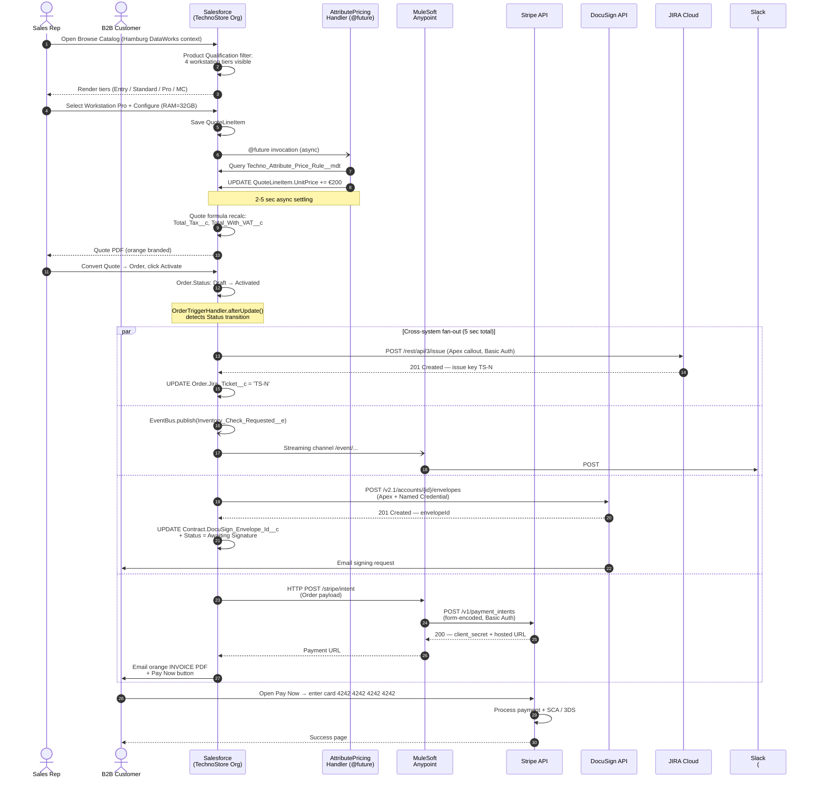
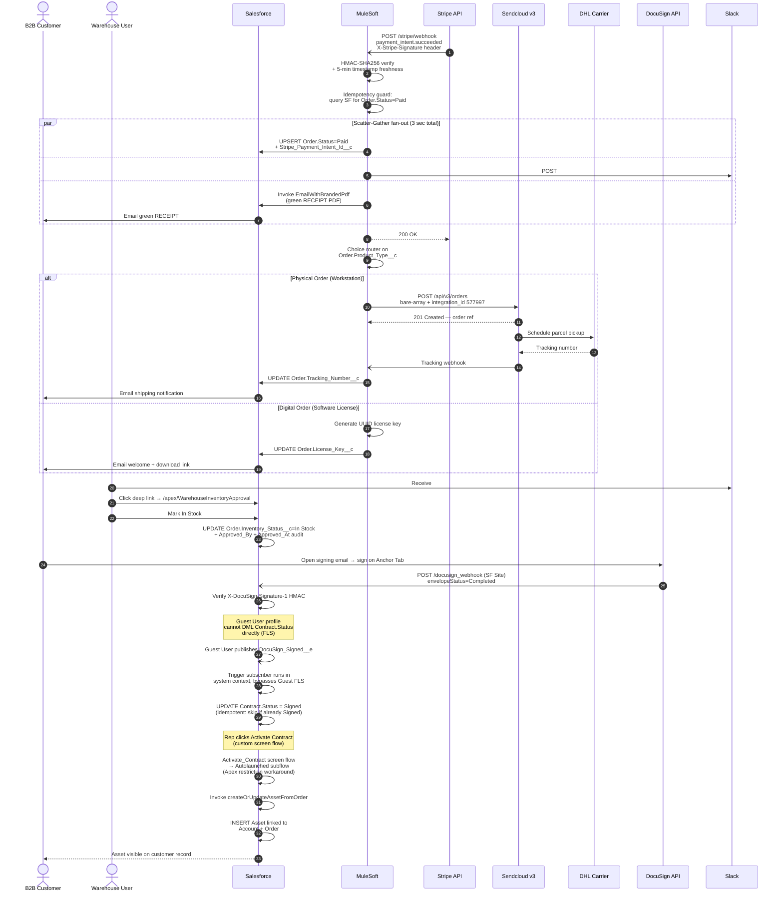

# 03 — Quote-to-Cash Sequence Diagram

## Purpose

Shows the complete **Quote-to-Cash lifecycle** as a time-ordered sequence of messages between actors and systems. Each arrow is a real HTTP call, DML, or webhook delivery. Latency numbers reflect measured performance in the production demo recording (2026-05-01).

This is **the diagram recruiters ask about in interviews**. Print it before the call.

## Diagram — Part 1: Quote → Order activation → Payment

## Diagram — Part 2: Payment webhook → Fulfillment → Contract signing → Asset

## Latency budget (measured end-to-end)

| Stage | Elapsed time | Bottleneck |
|-------|--------------|------------|
| Browse Catalog → Quote saved | <2 sec | Product Qualification SOQL |
| Quote → Order Activate | <1 sec | Sync DML |
| Cross-system fan-out (JIRA + Slack + DocuSign + Stripe + email) | 2-6 sec | DocuSign envelope creation (slowest) |
| Customer click Pay Now → Stripe payment confirmation | 30-90 sec | Customer action |
| Stripe webhook → SF Order=Paid + RECEIPT + Slack | 2-5 sec | HMAC verify + Scatter-Gather |
| Mule Choice Router → Sendcloud → DHL pickup scheduled | 3-10 sec | Sendcloud carrier routing |
| DocuSign signed → Contract.Status=Signed | 30-60 sec | DocuSign Connect delivery |
| Activate Contract → Asset created | <5 sec | Sync subflow + DML |
| **Total Q2C lifecycle (excluding customer wait time)** | **~60 sec** | |

## Key sequence observations

1. **Order activation triggers a 4-way parallel fan-out** (par/and blocks in Mermaid) — JIRA + Slack + DocuSign + Stripe + email all kick off within 1 second of `OrderTriggerHandler.afterUpdate()` firing. Total elapsed = max(branch latencies), not sum.
2. **The Stripe webhook handler is the most security-critical step** — HMAC-SHA256 verification with 5-minute timestamp freshness window prevents replay attacks + spoofed payment events. Without this, any actor with the webhook URL could fake payments.
3. **Guest User + Platform Event indirection** for the DocuSign signed webhook bypasses Salesforce's Guest profile FLS restriction on `Contract.Status`. Guest publishes a Platform Event; the trigger subscriber runs in system context with full FLS.
4. **The Activate Contract screen flow → Autolaunched subflow indirection** exists because `createOrUpdateAssetFromOrder` is only invocable from Autolaunched flow context. Screen flow cannot call it directly.
5. **Idempotency guards** appear at two places — Stripe webhook handler skips if Order is already Paid (Stripe retries on 5xx); DocuSign trigger subscriber skips if Contract is already Signed (DocuSign retries on non-2xx).

## Drill-down

For the data structures these messages move through, see [04 — Data Model](04-data-model.md).
