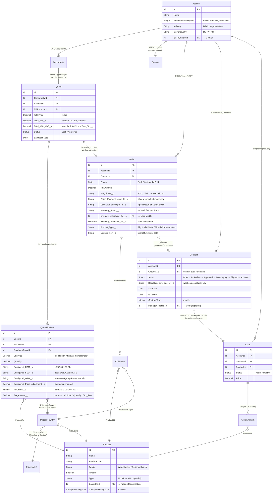

# 04 — Data Model (ERD)

## Purpose

Shows the **sObject relationships** that carry data through the Quote-to-Cash lifecycle, plus the Custom Settings, Custom Metadata, and Platform Events that the integration layer depends on. Standard relationships use Salesforce default cardinality; custom fields highlighted with the integration system they bind to.

Useful for: explaining the data flow to a new engineer, scoping migrations, validating schema changes against downstream impact.

## Core lifecycle ERD

## Integration support objects

```mermaid
erDiagram
    Notion_Config__c {
        Id Id PK
        Text Token__c "Bearer token"
        Text Parent_Page_Id__c "Notion page UUID"
    }
    Jira_Config__c {
        Id Id PK
        URL Base_URL__c "https://*.atlassian.net"
        Text Auth_Token__c "base64(email:token)"
        Text Project_Key__c "TS"
        Text Default_Issue_Type__c "Task"
    }
    DocuSign_Config__c {
        Id Id PK
        Text Account_Id__c "DocuSign API account UUID"
        URL Base_URL__c "demo.docusign.net / account-d.docusign.com"
        Text HMAC_Secret__c "webhook signature key"
    }
    Inventory_Check_Requested__e {
        Id OrderId__c "Platform Event field"
        String AccountName__c
        Decimal TotalAmount__c
        URL ApprovalUrl__c "deep link to VF page"
    }
    DocuSign_Signed__e {
        String Envelope_Id__c "Platform Event field"
        String Envelope_Status__c "Completed / Declined"
        DateTime Signed_At__c
    }
    Techno_Attribute_Price_Rule__mdt {
        Id MasterLabel PK
        Id Product2_Id__c "lookup-by-ID composite key"
        String Attribute_Name__c "RAM / SSD / GPU"
        String Attribute_Value__c "32GB / 1TB / Pro"
        Decimal Price_Adjustment__c "€200 / €150 / €400"
    }
```

## Standard objects + custom fields per integration

| sObject | Custom field | Bound to | Populated by |
|---------|--------------|----------|--------------|
| `QuoteLineItem` | `Tax_Rate__c`, `Tax_Amount__c` | DACH VAT (19%) | Formula (no Apex) |
| `QuoteLineItem` | `Configured_RAM__c`, `Configured_SSD__c`, `Configured_GPU__c` | Bundle configurator | UI selection |
| `QuoteLineItem` | `Configured_Price_Adjustment__c` | AttributePricingHandler idempotency | `@future` Apex |
| `Quote` | `Total_Tax__c` | DACH VAT rollup | Rollup Summary |
| `Quote` | `Total_With_VAT__c` | Quote PDF display | Formula |
| `Order` | `Jira_Ticket__c` | JIRA REST API | `JiraTicketService.createForOrder()` |
| `Order` | `Stripe_Payment_Intent_Id__c` | Stripe webhook idempotency | Mule SF Connector |
| `Order` | `DocuSign_Envelope_Id__c` | DocuSign envelope correlation | `DocuSignSendForSignatureService` |
| `Order` | `Inventory_Status__c`, `Inventory_Approved_By/At__c` | Warehouse VF page audit | `WarehouseInventoryApprovalController` |
| `Order` | `Product_Type__c` | Mule Choice router | Apex trigger on OrderItem insert |
| `Order` | `License_Key__c` | Digital fulfillment | Mule UUID generator |
| `Contract` | `DocuSign_Envelope_Id__c` | DocuSign webhook correlation | `DocuSignSendForSignatureService` |
| `Contract` | `Manager_Profile__c` | Approval Process routing | Manual lookup |

## Cardinality + delete behavior

- **Account → Opportunity / Order / Contract / Asset**: 1:N, default cascade. Deleting Account purges all children — by design, since these records have no value without parent context.
- **Opportunity → Quote**: nominally 1:N but in this demo 1:1 (one Quote per Opp). Quote.OpportunityId is a Master-Detail-like reference (deleteConstraint=SetNull would orphan revenue data).
- **Quote → Order**: created via `Convert to Order` Lightning action. Quote remains for historical reference.
- **Order → Contract**: 1:0..1. Order may exist without Contract (immediate fulfillment scenarios). Contract always references back via `OrderId__c` custom field.
- **Contract → Asset**: 1:N via `createOrUpdateAssetFromOrder` invocable. Asset persists even if Contract is renewed.
- **Custom Setting deletions** are blocked at platform level for Protected Hierarchy Custom Settings to prevent accidental credential wipes.

## Key data model observations

1. **Product2.Type=NULL is a hard-coded constraint** — not enforced by platform but required for Browse Catalog visibility (entry 8 in Notion portfolio). The field is read-only after insert; fixing requires record recreation.
2. **PricebookEntry is the catalog membership gate** — even with RLM PricingProcedure, products without active PricebookEntry on the Standard Pricebook are invisible to Quote line item lookup.
3. **Custom Metadata over Custom Settings** for `Techno_Attribute_Price_Rule__mdt` because mdt is deployable via SFDX (version-controlled) and has no governor cost on `getAll()`. Custom Settings reserved for credentials (Protected Hierarchy avoids accidental record exposure).
4. **Platform Events have no FK relationships** — they're message-bus records, not persisted state. `Inventory_Check_Requested__e` carries OrderId as text, not as a true Salesforce Id lookup, because Mule subscribers don't have FLS context.
5. **The integration correlation pattern** uses external IDs stored on Order/Contract: `Stripe_Payment_Intent_Id__c`, `DocuSign_Envelope_Id__c`, `Jira_Ticket__c`. Inbound webhooks query by these fields rather than internal Salesforce Ids, since external systems only know the external Id.

## Drill-down

For the deployment pipeline that pushes this schema into a Salesforce org, see [05 — CI/CD Pipeline](05-cicd.md).
