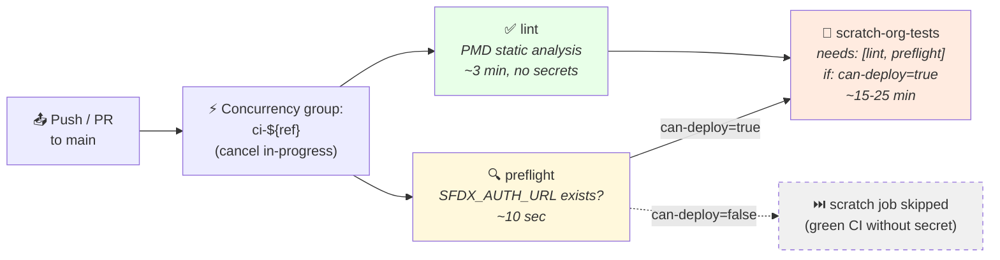

# 05 — CI/CD Pipeline

## Purpose

Shows how code travels from a developer's laptop through GitHub Actions, into a Salesforce scratch org for automated tests, and onward to sandbox + production environments. Captures both the **always-on lint path** (no secrets) and the **conditional scratch-org test path** (requires `SFDX_AUTH_URL` secret).

Useful for: explaining the deployment story in DevOps interviews, onboarding new contributors to the PR workflow, scoping production promotion automation.

## Pipeline diagram

```mermaid
graph LR
    %% ============ Developer side ============
    Dev(["👨‍💻 Developer<br/><i>Mustafa Aksu</i>"])
    Local["💻 Local Workstation<br/><i>VS Code + sf CLI v2<br/>+ Husky pre-commit hook<br/>+ Prettier auto-format</i>"]
    PreCommit["🪝 .husky/pre-commit<br/><i>lint-staged<br/>+ prettier --write</i>"]

    %% ============ GitHub Cloud ============
    subgraph GHCloud["☁️ GitHub Cloud"]
        Branch["🌿 Feature Branch<br/><i>git push origin feature/*</i>"]
        PR["🔀 Pull Request → main"]
        Main["🌳 main branch"]
    end

    %% ============ GitHub Actions ============
    subgraph Actions["⚡ GitHub Actions (CI)"]
        direction TB

        subgraph LintJob["lint — PMD static analysis (always runs)"]
            Checkout1["Check out source"]
            JavaSetup["Setup Java 17 (Temurin)"]
            PMDCache["Cache PMD 7.7.0"]
            PMDRun["Run PMD on 5 SFDX dirs<br/><i>pmd-ruleset.xml</i>"]
        end

        subgraph Preflight["preflight — Check SFDX_AUTH_URL secret"]
            CheckSecret["Echo can-deploy=true/false"]
        end

        subgraph ScratchJob["scratch-org-tests (conditional on secret)"]
            Checkout2["Check out source"]
            NodeSetup["Setup Node 20"]
            SFCLI["Install sf CLI"]
            AuthDevHub["sf org login sfdx-url<br/><i>DevHub via SFDX_AUTH_URL</i>"]
            CreateScratch["Create scratch org<br/><i>config/project-scratch-def.json<br/>+ Industries CPQ + RLM + CLM features</i>"]
            DeployAll["Deploy all 5 packages<br/><i>force-app + controllers + services<br/>+ handlers + actions + tests</i>"]
            AssignPS["Assign Notion_Publisher_Access<br/>permission set"]
            RunTests["sf apex run test<br/><i>RunLocalTests + --code-coverage</i>"]
            DeleteScratch["Delete scratch org<br/><i>(if: always)</i>"]
        end
    end

    %% ============ Manual promotion (post-PR) ============
    subgraph Promote["🚀 Manual Promotion (post-merge)"]
        ValidateSandbox["sf project deploy validate<br/><i>--source-dir force-app/* <br/>--test-level RunLocalTests</i>"]
        QuickDeploy["sf project deploy quick<br/><i>--job-id (from validate)</i>"]
        Sandbox["🧪 Sandbox<br/><i>Pre-production validation</i>"]
        Production["🏭 Production<br/><i>TechnoStore Org<br/>(manual gate)</i>"]
    end

    %% ============ External deploy targets ============
    Mule["🔌 MuleSoft CloudHub 1.0<br/><i>Anypoint Runtime Manager<br/>(separate pipeline)</i>"]

    %% ============ Flow ============
    Dev --> Local
    Local --> PreCommit
    PreCommit -->|"git commit"| Branch
    Branch -->|"git push"| GHCloud
    Branch --> PR
    PR --> Main

    PR -.->|"triggers"| Actions
    Main -.->|"triggers"| Actions

    Checkout1 --> JavaSetup --> PMDCache --> PMDRun
    CheckSecret
    Checkout2 --> NodeSetup --> SFCLI --> AuthDevHub --> CreateScratch
    CreateScratch --> DeployAll --> AssignPS --> RunTests --> DeleteScratch

    LintJob -.->|"needs"| ScratchJob
    Preflight -.->|"needs<br/>+ if can-deploy"| ScratchJob

    Main -->|"after merge"| ValidateSandbox
    ValidateSandbox -->|"if green"| QuickDeploy
    QuickDeploy --> Sandbox
    Sandbox -->|"manual approval"| Production

    Local -.->|"separate Mule deploy"| Mule
    Production -.->|"Mule depends on SF schema"| Mule

    %% ============ Styling ============
    style Dev fill:#FFE4B5
    style Production fill:#003F7F,color:#fff
    style Sandbox fill:#FFF8DC
    style LintJob fill:#E8FFE8
    style ScratchJob fill:#FFEBE0
    style Preflight fill:#FFF8DC
    style Mule fill:#00A0DF,color:#fff
```



## Job DAG (GitHub Actions internals)

The workflow uses **concurrency cancellation** (older runs on the same branch are superseded by newer commits) and **conditional execution** (scratch-org job only runs if the SFDX_AUTH_URL secret is configured).



## Stage-by-stage walkthrough

### Stage 1 — Local development

| Step | Tool | Purpose |
|------|------|---------|
| Code change | VS Code + Salesforce extension | Edit Apex / metadata |
| Save → Prettier auto-format | Prettier + `@prettier/plugin-xml` + `prettier-plugin-apex` | Consistent code style |
| `git commit` | Husky pre-commit hook → `npm run precommit` → `lint-staged` | Auto-format staged files + run ESLint on LWC |

### Stage 2 — GitHub Actions on push/PR

| Job | Always runs? | Duration | What it does |
|-----|--------------|----------|--------------|
| **lint** | ✅ Yes | ~3 min | Setup Java 17 → cache PMD 7.7.0 → scan all 5 SFDX package dirs against `pmd-ruleset.xml` |
| **preflight** | ✅ Yes | ~10 sec | Check whether `SFDX_AUTH_URL` repo secret exists → output `can-deploy=true/false` |
| **scratch-org-tests** | ❌ Conditional on secret | ~15-25 min | Auth DevHub → create scratch org (Industries CPQ + RLM + CLM features) → deploy 5 packages → assign permission set → run all Apex tests with coverage → delete scratch org |

### Stage 3 — Post-merge promotion

Manual steps, not automated (intentional gate for production):

```bash
# Validate against sandbox without committing (transaction rolled back)
sf project deploy validate \
  --source-dir force-app --source-dir force-app-controllers \
  --source-dir force-app-services --source-dir force-app-handlers \
  --source-dir force-app-actions \
  --test-level RunLocalTests \
  --target-org TechnoStoreSandbox

# If green, promote without re-running tests
sf project deploy quick --job-id <id-from-validate> --target-org TechnoStoreProd
```

The `validate` flag wraps deploy + tests in a single transaction that rolls back on completion, so the target org is unchanged regardless of result. `deploy quick` then promotes the exact-same artifact bundle to production without re-running tests (saves ~20 min on the production deploy window).

## Key CI/CD observations

1. **Two-tier CI** — the lint job runs without any secret, so external contributors see green CI immediately. The scratch-org job requires a configured `SFDX_AUTH_URL` secret pointing at a DevHub. Without the secret, the scratch-org job is *skipped* (not failed) — keeps the run dashboard clean.
2. **Concurrency cancellation** prevents racing CI runs when multiple commits land back-to-back. Only the newest commit's run goes to completion; older runs show as "Cancelled" cleanly.
3. **Industries CPQ + RLM + CLM features** in `config/project-scratch-def.json` are non-negotiable for TechnoStore — without them the deploy fails before any test runs because RLM-specific sObjects (PricingProcedure, ProductQualificationProcedure) don't exist.
4. **PMD warm-up mode** (`|| true` on the run step) keeps CI green during initial rule tuning. Once the codebase is clean against the ruleset, the trailing `|| true` is removed to make violations a hard CI failure.
5. **Scratch org is deleted in an `if: always()` step** to prevent burning through scratch-org daily limits on the DevHub if a deploy or test step fails. The cleanup runs even on prior step failure.
6. **MuleSoft has a separate deployment pipeline** — not part of this Salesforce CI/CD flow. Mule artifacts deploy to CloudHub 1.0 via Anypoint Runtime Manager (manual or Mule-specific Jenkins/CircleCI flow). The Salesforce-side metadata changes that affect Mule (e.g., new Platform Event schema) require coordinated deploy.

## Future enhancements

- **Auto-promotion to sandbox** on merge to main (currently manual `validate` + `quick`)
- **Slack #engineering notification** on production deploy success/failure (Mule webhook reusable here)
- **MuleSoft CI/CD pipeline** wired to the same GitHub repo via `mulesoft/` subdirectory + Anypoint deploy step
- **Apex code coverage gate** — block merge if any new class is below 85% (currently warm-up mode)
- **Security review job** using PMD's `category/apex/security.xml` as a hard fail rather than warning

## Drill-down

For the Architecture overview that motivates these deploy targets, see [01 — Context](01-context.md). For internal Salesforce + Mule containers being deployed, see [02 — Container](02-container.md).
