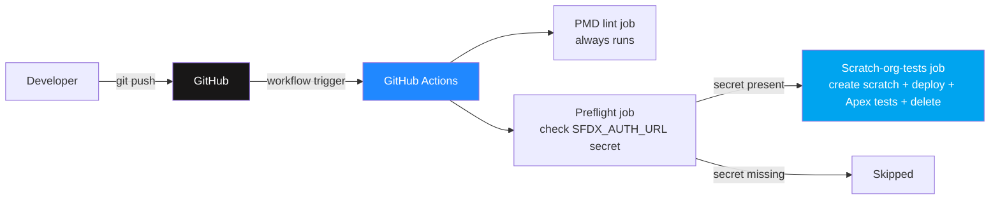
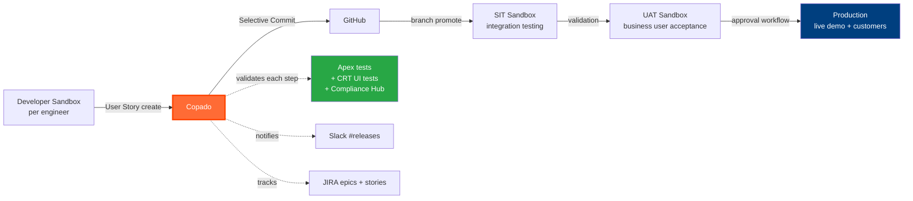

# Copado Integration Plan — Production Scaling Path

> **Honest framing**: TechnoStore currently uses **GitHub Actions + SFDX** as its CI/CD pipeline ([.github/workflows/ci.yml](../.github/workflows/ci.yml)). This document describes the **planned migration path to Copado** for when the project scales from a single Developer Edition org to a multi-org production landscape. It is **not** a claim that Copado is currently in use.
>
> The document exists to (1) demonstrate that the engineering team understands Copado's value proposition + architecture, (2) provide a defensible production-scaling story for architecture-review conversations, and (3) capture the migration roadmap in the same place the rest of the architecture documentation lives.

| Metadata | Value |
|----------|-------|
| Document type | Migration plan (future state) |
| Current state | GitHub Actions + SFDX (working) |
| Target state | Copado Essentials + 4-org pipeline (planned Q3 2026) |
| Status | Planned — not yet implemented |
| Owner | Mustafa Aksu |
| Last revised | 2026-05-11 |

---

## 1. Why migrate to Copado eventually?

TechnoStore's GitHub Actions CI workflow is **adequate for a single Developer Edition demo project**. It works reliably for the current scope and was the right choice for portfolio-phase development (see [ADR-006](adr/ADR-006-anypoint-studio-over-code-builder.md) for the same "boring tool wins" reasoning applied to MuleSoft).

The CI/CD friction that justifies adopting Copado does **not** exist in TechnoStore's current state. It would emerge if and when:

- The project moves from 1 Dev Edition org to a multi-org landscape (Dev → SIT → UAT → Production sandboxes)
- Multiple engineers contribute to the same Salesforce metadata simultaneously, creating profile/permission-set merge conflicts
- Production deployments require formal approval workflows + audit trails (SOX, GDPR, financial compliance)
- UI regression test coverage becomes a release gate (Lightning page validation, LWC interaction testing)
- Multi-team coordination requires shared User Story tracking with explicit promotion stages

DACH enterprise Salesforce teams hit these triggers consistently. The migration path documented below ensures TechnoStore could scale into that operational mode without rebuilding the CI/CD foundation.

## 2. What Copado is

**Copado** is the leading enterprise DevOps platform purpose-built for the Salesforce ecosystem. It's a SaaS product (with a Salesforce-installed managed package counterpart) that automates the Salesforce-specific deployment complexities GitHub Actions cannot address out-of-the-box: profile merging, permission-set diffing, validation rule ordering, Apex test orchestration across orgs, and User Story-driven release management.

### Core concepts

| Concept | Purpose |
|---------|---------|
| **User Story** | The unit of work. Maps to a JIRA ticket or business requirement. Carries metadata changes, test results, approval state, and deployment history. |
| **Promotion** | Moving a User Story from one environment to the next (Dev → SIT → UAT → Prod). Each promotion runs validation tests + can require approval. |
| **Pipeline** | The visual, configurable orchestration of promotions across environments. Branches in Git correspond to pipeline stages. |
| **Selective Commit** | Granular control over which metadata changes belong to which User Story — avoids the "git diff of an entire org" anti-pattern. |
| **Validation** | Salesforce `sf project deploy validate` invocation orchestrated by Copado before promote. Confirms tests pass + deploy would succeed without committing. |
| **CCM (Copado Change Management)** | The release coordination layer — combines User Stories into Releases, tracks dependencies, enforces gates. |
| **CRT (Copado Robotic Testing)** | Selenium-equivalent UI test automation specifically tuned for Lightning Experience + Apex page navigation. |
| **Compliance Hub** | Audit + governance layer — SOX, GDPR, custom compliance rules executed on every deployment with reportable trail. |
| **Connections** | Copado's authentication to external systems (Git providers, Salesforce orgs, Slack, JIRA, ServiceNow). |

## 3. Current state — GitHub Actions

For the **as-is**, see [`.github/workflows/ci.yml`](../.github/workflows/ci.yml). Summary:



**What works:**
- PMD static analysis on every push/PR (always runs, no secrets needed)
- Conditional scratch-org deploy + test run when `SFDX_AUTH_URL` secret is configured
- Test coverage measured via `sf apex run test --code-coverage`
- 6-package SFDX layout deployed in one `sf project deploy start` invocation

**What's missing for production-scale operations:**
- No visual pipeline UI — the workflow lives as YAML
- No User Story-level tracking — every commit is equivalent
- No multi-org promotion (only scratch orgs)
- No approval workflows before production deploy
- No UI regression testing (CRT-equivalent)
- No compliance audit log linking commits → approvals → deployments → users
- Profile + permission-set merge conflicts handled manually if multiple engineers diverge
- Rollback is `git revert` + redeploy (no Copado-equivalent versioned rollback)

## 4. Target state — Copado pipeline (planned)



### 4.1 Pipeline stages

| Stage | Org | Purpose | Promote criteria |
|-------|-----|---------|------------------|
| **Dev** | Developer Sandbox (1 per engineer) | Active coding + first-pass Apex tests | All Apex tests pass; PMD clean |
| **SIT** | Shared integration sandbox | Cross-feature integration testing | All Apex tests pass; Mule integration smoke tests pass; CRT regression suite green |
| **UAT** | Business user acceptance sandbox | Sales / warehouse / finance team validation | Manual sign-off in Copado UAT phase; demo recordings updated |
| **Production** | Live customer-facing org | Real customer transactions | Architect approval; release manager approval; compliance check pass |

### 4.2 User Story lifecycle

A typical User Story in TechnoStore-on-Copado would flow:

1. **Create in JIRA** — e.g., `TS-15: Add multi-country VAT lookup for AT/CH accounts`
2. **Copado syncs** the JIRA ticket → creates a Copado User Story record
3. **Developer commits** metadata to their Dev sandbox via Copado VS Code extension or Copado UI
4. **Selective Commit** identifies which files belong to this User Story
5. **Promote to SIT** — Copado validates, runs Apex tests, deploys to SIT
6. **Integration tests** run automatically (Mule HTTP listeners exercised against SIT-side Salesforce)
7. **Promote to UAT** — business users test the multi-country VAT calculation
8. **Approve in UAT** — finance lead clicks Approve in Copado
9. **Promote to Production** — Compliance Hub runs final checks (SOX rules, GDPR data residency rules)
10. **Production deploy** — Copado orchestrates the deploy, records the audit trail, notifies #releases Slack channel

## 5. Migration steps (planned Q3 2026)

These are the concrete steps to actually migrate TechnoStore from GitHub Actions to Copado, **if and when** the project scales beyond Developer Edition.

### 5.1 Prerequisites

- Copado Essentials subscription (or higher tier — pricing in Section 7)
- 4 Salesforce orgs: 1 Dev (or scratch-org-per-engineer), 1 SIT sandbox, 1 UAT sandbox, 1 Production sandbox or production org
- Salesforce Developer Hub (DevHub) for scratch-org provisioning if using ephemeral Dev orgs
- Git remote (GitHub repo `aksumustafa1625/TechnoStore` — already in place)
- JIRA Cloud workspace (already in place — TS project)
- Slack workspace (already in place — `#payments-team`, `#warehouse` channels)

### 5.2 Installation + initial setup

```
1. Provision Copado workspace at copado.com
   - Connect to Salesforce via OAuth
   - Authorize all 4 target orgs (Dev / SIT / UAT / Production)

2. Install Copado managed package in each target Salesforce org
   - AppExchange listing: "Copado DevOps"
   - Approximately 200 Apex classes + 50 custom objects + 30 permission sets

3. Configure Copado Connections
   - GitHub: PAT or GitHub App for branch operations
   - JIRA: API token for User Story sync
   - Slack: incoming webhook URLs for #releases notifications

4. Set up Pipeline structure in Copado UI
   - Define 4 environments (Dev / SIT / UAT / Prod)
   - Map Git branches: feature/* -> develop -> release/* -> main
   - Configure promotion direction + validation steps per arrow

5. Import existing TechnoStore metadata baseline
   - Copado will scan the connected orgs + Git repo
   - Initial commit + sync establishes the baseline
```

### 5.3 Migrate CI workflow logic

| Current GitHub Actions step | Copado equivalent |
|------------------------------|-------------------|
| `lint` job — PMD against 5 SFDX packages | Copado Compliance Hub: import `pmd-ruleset.xml` as a rule pack, executes on every commit |
| `preflight` job — check SFDX_AUTH_URL secret | Not needed in Copado — connections are first-class entities |
| `scratch-org-tests` job — create scratch + deploy + test | Copado Pipeline: validation step on each Promote action calls `sf apex run test` against the target org natively |
| Manual test coverage reporting | Copado Test Insights — coverage trends, slow-test detection, flaky-test identification |
| (none) | Copado CRT — adds Lightning UI regression tests run on every UAT promotion |
| `git push` triggers workflow | Copado Selective Commit triggers User Story creation + validation |

### 5.4 Pipeline as code (target state)

Copado pipelines can also be expressed declaratively (Copado Essentials supports YAML pipeline definitions). The migration target would replace `.github/workflows/ci.yml` with something like:

```yaml
# Conceptual — actual Copado pipeline YAML syntax may vary
name: TechnoStore Production Pipeline

environments:
  - name: Dev
    type: scratch-org
    duration-days: 7
  - name: SIT
    type: sandbox
    org-alias: technostore-sit
  - name: UAT
    type: sandbox
    org-alias: technostore-uat
  - name: Production
    type: production
    org-alias: technostore-prod
    requires-approval: true

stages:
  - name: validate
    on: commit
    runs:
      - pmd-lint
      - apex-test --level RunLocalTests
      - copado-compliance-hub

  - name: promote-to-sit
    on: user-story-approved
    runs:
      - sf-project-deploy-validate
      - mule-integration-tests
      - crt-regression-suite

  - name: promote-to-uat
    on: sit-tests-passed
    runs:
      - sf-project-deploy
      - manual-business-acceptance

  - name: promote-to-prod
    on: uat-approved
    requires:
      - architect-approval
      - release-manager-approval
      - compliance-hub-pass
    runs:
      - sf-project-deploy
      - slack-notify-releases
      - jira-mark-stories-done
```

## 6. Copado-specific concepts to learn

These are the concepts an engineer joining a Copado-using team would need to internalize. Listed here for self-study reference rather than as project-internal documentation:

| Concept | One-line summary | Where to learn |
|---------|------------------|----------------|
| User Story Bundle | Group related User Stories for atomic promotion | Copado Academy → Foundations track |
| Selective Commit Rules | Configure which metadata types are part of which User Story types | Copado documentation → Commit Management |
| Promotion Branches | Git branch naming conventions Copado expects (feature/, develop, main, etc.) | Copado documentation → Git Branching Strategies |
| Back-Promotion | Sync changes made directly in UAT/Prod back to Dev (rare but important) | Copado Academy → Advanced track |
| Conflict Resolution | When two User Stories touch the same metadata, Copado provides UI for merge | Copado Academy → Conflict Management |
| Data Templates | Move sample data (Account, Product2) across orgs alongside metadata | Copado documentation → Data Management |
| Pipeline Permissions | Who can promote to Production? Configure per stage. | Copado documentation → Access Control |
| Quality Gates | Block promotion if test coverage < X% or PMD violations > Y | Copado documentation → Quality |
| CRT Test Cases | Record Lightning UI workflow as a CRT test case | CRT Academy → Recording test cases |
| Compliance Hub Rules | Express SOX / GDPR / project-specific rules as Compliance Hub rules | Compliance Hub documentation |

## 7. Cost analysis

Copado is a paid SaaS product. Pricing as of 2026 (subject to vendor changes):

| Tier | Approximate cost | Suitable for |
|------|------------------|--------------|
| **Copado Essentials** | $200-400/user/month | Solo + small team, basic pipeline |
| **Copado Premium** | $500-800/user/month | Mid-size team, CRT included, multi-pipeline |
| **Copado Enterprise** | Custom pricing | Large enterprise, Compliance Hub + Robotic Testing + Sandbox refresh automation |

**30-day free trial** is available for Essentials, but expires fully and requires re-provisioning to restart.

For TechnoStore in current portfolio scope: **cost is the primary blocker**. The project's value proposition does not currently justify ~$300/month in Copado licensing. The migration becomes viable when the project monetizes (e.g., becomes a productized demo or scales to a real DACH customer rollout).

## 8. When to migrate vs stay on GitHub Actions

| Stay on GitHub Actions if | Migrate to Copado if |
|---------------------------|----------------------|
| Single Developer Edition org | Multi-org sandbox + production landscape |
| Solo engineer | 3+ engineers contributing concurrently |
| Demo/portfolio scope | Real customer-facing deployment |
| Cost-sensitive (<$100/month tooling budget) | Cost-tolerant ($500+/month budget) |
| Profile/permission-set complexity is low | Profile/permission-set complexity is high |
| Manual approval workflows acceptable | Need audit trail for SOX/GDPR compliance |
| UI regression risk is low (small surface) | UI regression risk is high (LWC-heavy + Lightning page customizations) |

**TechnoStore is currently in the left column.** The migration plan exists so the path forward is clear when conditions change.

## 9. How to demonstrate Copado knowledge without using Copado

If an interviewer or recruiter asks about Copado experience and the honest answer is "not yet hands-on", here are credible positioning statements based on this document + the underlying architecture work:

> "TechnoStore currently uses GitHub Actions with PMD + scratch-org tests, which works at single-org scale. I've documented the migration path to Copado in `docs/copado-integration-plan.md` covering pipeline structure, User Story flow, and the GitHub Actions → Copado equivalent mapping. I understand the value proposition — multi-org promotion, Selective Commit, Compliance Hub — and have a clear picture of where my current setup ends and where Copado would start adding value. I'd appreciate the opportunity to get hands-on with Copado on the job."

> "The Mule vs Apex decision matrix in ADR-001 is the same kind of architectural reasoning Copado pipelines codify — choose the right tool for each integration point. The pattern translates."

> "Storage management on Developer Edition (Notion entry 42) and Salesforce platform gotchas (Notion entry 8) are the kinds of operational details Copado's Compliance Hub would prevent. I've solved them manually so far; Copado is the next maturity level."

These framings are honest, demonstrate competence in the surrounding work, and position Copado as a learning opportunity rather than a fabricated skill claim.

## 10. Learning resources

For getting hands-on Copado experience:

| Resource | Type | Cost |
|----------|------|------|
| [Copado Academy](https://academy.copado.com/) | Self-paced courses + certification | Free for Foundations; paid for Advanced + CRT + Compliance Hub |
| [Copado Trailblazers Community](https://success.copado.com/) | Q&A, community-led tips | Free |
| Copado Certified Administrator exam | Industry-recognized credential | ~$200 USD exam fee |
| Copado Certified Developer exam | Deeper technical certification | ~$200 USD exam fee |
| YouTube — search "Copado tutorial 2025" | Free videos | Free |
| 30-day Essentials trial | Hands-on with a real Copado workspace | Free (trial expires) |

**Recommended learning path** (for someone in TechnoStore's position):

1. Copado Academy Foundations track (~8 hours self-paced, free)
2. 30-day Essentials trial → set up a simple 2-org pipeline
3. Copado Certified Administrator exam
4. Apply for roles citing "Copado Foundations completed + 30-day hands-on trial + Administrator certified"

This trajectory is realistic in ~3-4 weeks and produces a defensible claim of "Copado-aware engineer, ready to scale up on the job."

---

## Related documentation

- [.github/workflows/ci.yml](../.github/workflows/ci.yml) — current GitHub Actions CI workflow
- [docs/architecture/05-cicd.md](architecture/05-cicd.md) — current CI/CD architecture diagram
- [docs/SOLUTION_BLUEPRINT.md](SOLUTION_BLUEPRINT.md) — full architecture summary (Section 7 Deployment View + Section 11.3 Roadmap)
- [docs/adr/ADR-006-anypoint-studio-over-code-builder.md](adr/ADR-006-anypoint-studio-over-code-builder.md) — same "mature tool beats new tool for production reliability" reasoning, applied to MuleSoft

---

*This is a living document — update when the migration actually happens or when the migration plan changes.*
